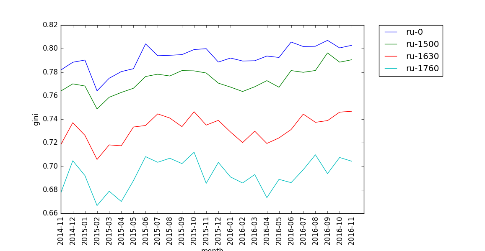

# PokéAnalytics

A much-awaited follow-up to the idea proposed [here](http://www.smogon.com/forums/threads/using-usage-statistics-to-analyze-metagame-balance.3509445/), this project combines Pokemon Showdown usage data with canonical inequality/diversity metrics from social sciences to calculate quantitative metrics for the otherwise hand-wavey concept of [metagame balance](http://www.smogon.com/forums/threads/characteristics-of-a-desirable-pokemon-metagame.66515/).

## How To
- From the project directory, run `bash ./scripts/scraper.sh` to scrape usage data from smogon. Change the list of files as desired in the script file. The script will place all json files in a data directory. 
- Once you have your data, you can compute the balance metric for a given file like so:
```
python analysis/balance_metrics.py --month 2016-11 --format ru-1760 --metric gini
```
This will print the value of the metric. 
- More importantly, you can plot (courtesy matplotlib) the value of a given metric for a given format over time by simply not providing the month: 
```
python analysis/balance_metrics.py --format ru-1760 --metric gini
```
- And you can plot multiple formats on the same figure by providing multiple arguments to the format flag:
```
python analysis/balance_metrics.py --format ru-0 ru-1500 ru-1630 ru-1760 --metric gini
```

The plot given by the last command:



## Metrics
The metrics implemented, and there corresponding format flag argument:
- [Gini coefficient](https://en.wikipedia.org/wiki/Gini_coefficient) `gini`
- True diversity `diversity`
- Richness `richness`
- Shannon index `shannon`
- Rényi entropy `renyi`
- Simpson index `simpson`
- Gini-Simpson `gini_simpson`
- Berger-Parker index `berger_parker`

The diversity indices and their calculations are from [wikipedia](https://en.wikipedia.org/wiki/Diversity_index).